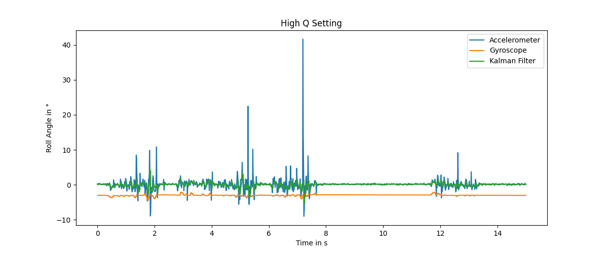
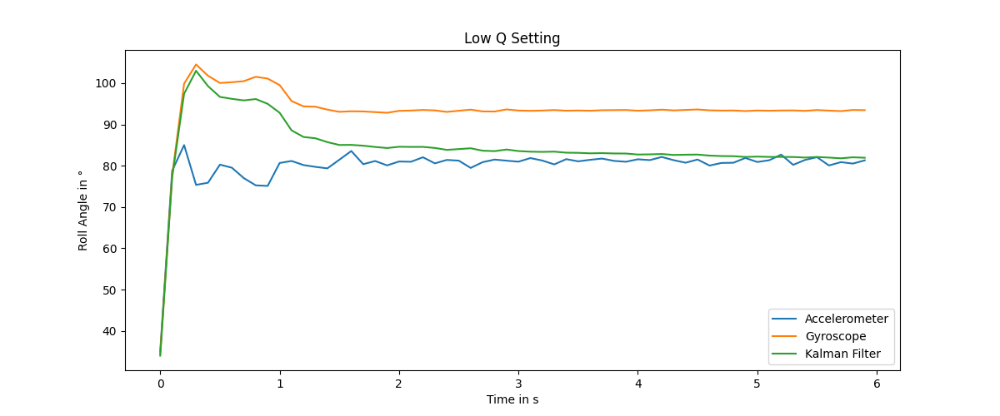
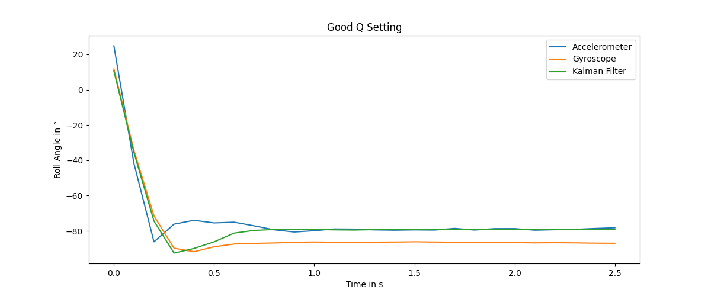
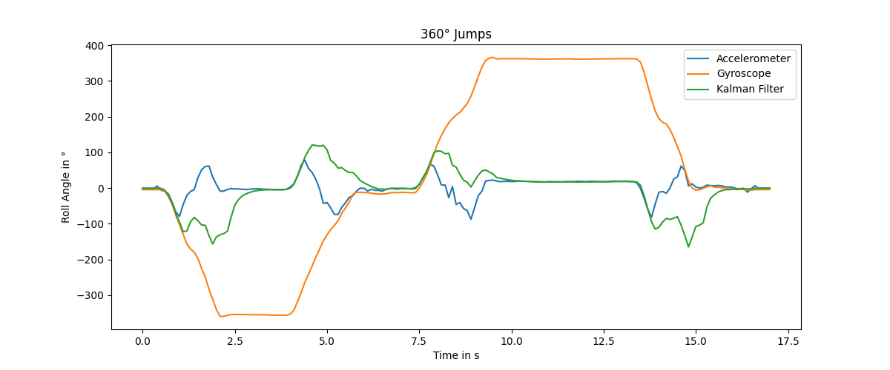

# ESP32 Drone

The aim of this project is to build a with as many self build and/or cheap components. It shall be used to explain the theory behind drones, therefore also measuring the angle, filtering the sensor data and how to control the drones motors. This project will concentrate on the software side of drones, but can be later extended to implement the hardware parts such as buck converter, motorcontroller and so on.

## Sensor Setup

So far the project only consists of an ESP32 as brain and a MPU9250 Sensor to measure the total angle of the drone. In the following table I want to show the pin configurations used so far:

|   ESP 32 - GPIO Pin    |        Funktion        |       Kommentar        |
|------------------------|------------------------|------------------------|
|          32            |       MPU SDA_PIN      |                        |
|          33            |       MPU SCL_PIN      |                        |

Please make sure to also connect GND and 3.3V to all the components.

## Kalman Filter

### Theory

In order to conroll the drone we need to measure the absolut angle of it constantly. For that the MPU9250 is being used. The Sensor consists of a accelerometer to measure the acceleration in all three dimension, a gyroscope to get the angular acceleration and a magnetometer to measure the magnetic field of the earth.

#### The problem

- The gyroscope measures angular velocity and is smooth in the short term, but it drifts over time, especially because we have to integrate the sensor value in order to get the angle, which makes the error even bigger.
- The accelerometer can estimate orientation relative to gravity, but it is noisy and sensitive to vibrations and movement.
- The magnetometer just measures the horizontal direction of the drone.

#### The solution: Sensor fusion with a Kalman filter

The Kalman filter combines both sensors to balance their weaknesses by fusing those values. Therefore the filter needs a model which is in our case the integrated values of the gyroscope. In order to integrate them, the value is the new reading is added to the old sum *angleRollGyro* and then multiplied with the time between two measurement *dt* (See function *calcAngles*). The sensor is then used to 'guess' the next angle of the drone.

To improve this prediction, the accelerometer is used as a reference measurement.  
While noisy, it provides an absolute estimate of the angle based on gravity. The Kalman filter uses these accelerometer values to correct the prediction and compensate for the gyroscope’s drift over time.

#### Adjust the filter

In order to adjust the filter we have two matrices which set the model uncertainty and the expected measurement noise.

##### Q_cov – Process Noise Covariance (Model Uncertainty)

The *Q_cov* matrix is being implented in the definition part of the code as shown:

BLA::Matrix<2, 2> Q_cov = {
    0.008*0.008, 0,
    0,           0.0002*0.0002
};

This matrix represents how uncertain your model (gyroscope-based prediction) is.

- The diagonal values are the variances (σ²) of your state variables.
- In a typical angle estimation, your state might be:
  - angle
  - gyro bias
  
So:

- Q_cov[1, 1] --> uncertainty in the angle prediction
- Q_cov[2, 2] --> uncertainty in the gyro bias

The off-diagonal elements are 0, meaning you assume the uncertainties are independent.

Interpretation:

- **Higher Q values:**  
With higher Q values, the filter trusts the measurements more, which makes the output very noisy.  
  
In this test, the sensor was placed on a table and shaken. The accelerometer reacts strongly, and the gyroscope has some drift. The Kalman filter follows the noise too closely, so the output is not good for drone control.

- **Lower Q values:**  
With lower Q values, the filter trusts the model more and reacts slower to measurements.  
  
The sensor was first slowly set upright and then rotated by 180°. The gyroscope overshoots, and the filter takes about 4 seconds to correct itself, which is too slow for real-time control.

- **Good Q values:**  
With good Q values, there is a balance between noise and response speed.  
  
The same test as in the low Q case was done. The filter removes most noise but still follows the motion well. It stabilizes in about 0.5 seconds, which is good for a drone.

##### Angle Wraparound Problem (360° Jump Issue)

During fast rotations, the gyroscope angle can continuously increase or decrease beyond the normal angle range.

The problem is that the Kalman filter expects angles in a limited range, typically:

- -180° to +180°

Without limiting the angle range, the gyroscope angle keeps accumulating over time.  
After several full rotations, the value grows continuously, even though physically the drone has only rotated in circles.

This creates a problem for the Kalman filter:

- The drone performs multiple full rotations (rolls or loopings)
- The gyroscope keeps adding angle values (e.g. 360°, 720°, 1080° ...)
- The accelerometer still reports a bounded angle around ±180°
- The Kalman filter sees a huge mismatch between prediction and measurement

This leads to:

- large temporary estimation errors
- wrong correction spikes
- unstable control output for a short time



The picture shows really well those unstable states of the filter. Even though it tries to get back to the measurements it takes always quiet some time to be at a stable rate again.

This is especially important for drones because they can perform fast **rolls and loopings**, where multiple full rotations happen within seconds.  
During such maneuvers, the raw gyro integration becomes invalid for control if not corrected.

To fix this, the angle is wrapped back into the range from -180° to +180°:

```cpp
if (angleRollGyro > 180) angleRollGyro -= 360;
if (angleRollGyro < -180) angleRollGyro += 360;
```

This technique is called **angle wraparound correction**.

Interpretation:

- If the angle becomes larger than +180°, 360° is subtracted
- If the angle becomes smaller than -180°, 360° is added

This ensures the gyro angle stays in a valid range and prevents accumulation errors from affecting the Kalman filter during aggressive drone maneuvers.